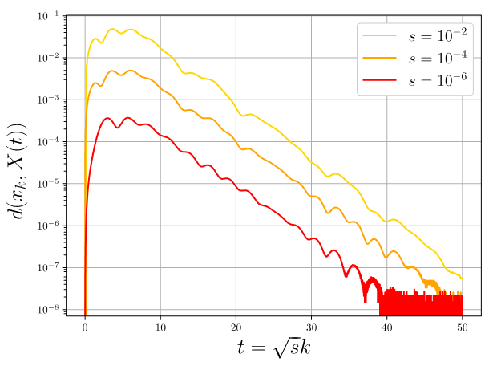

# RNAG
This repository includes an implementation of **Riemannian Nesterov Accelerated Gradient Method (RNAG)** in our paper [(Kim & Yang, 2022)][kim2022]. Our code is based on [Orvieto's code][orvietocode] [(Alimisis et al., 2021)][alimisis2021].

In optimizers.py, we implemented the algorithms RNAG-C and RNAG-SC.

## Requirements
pymanopt==0.2.5

geomstats==2.2.2

torch==1.9.0

scipy==1.5.0

numpy==1.19.5

matplotlib==3.2.2

## Results

### rayleigh_quotient.py
Rayleigh quotient maximization. [(Kim & Yang, 2022, Section 7)][kim2022]

### Karcher_mean_spd.py
Computing the Karcher mean of symmetric positive definite matrices. [(Kim & Yang, 2022, Section 7)][kim2022]

### Karcher_mean_hyperbolic.py
Computing the Karcher mean of points in the hyperbolic space. [(Kim & Yang, 2022, Section 7)][kim2022]

## limiting_convex.py
RNAG-C converges to the ODE [(Alimisis et al., 2020, Equation 2)][alimisis2020]. [(Kim & Yang, 2022, Appendix G)][kim2022]

## limiting_strongly_convex.py
RNAG-SC converges to the ODE [(Alimisis et al., 2020, Equation 4)][alimisis2020]. [(Kim & Yang, 2022, Appendix G)][kim2022]

[alimisis2020]: http://proceedings.mlr.press/v108/alimisis20a/alimisis20a-supp.pdf
[alimisis2021]: http://proceedings.mlr.press/v130/alimisis21a/alimisis21a-supp.pdf
[kim2022]: https://proceedings.mlr.press/v162/kim22k.html
[orvietocode]: https://github.com/aorvieto/RNAGsDR
